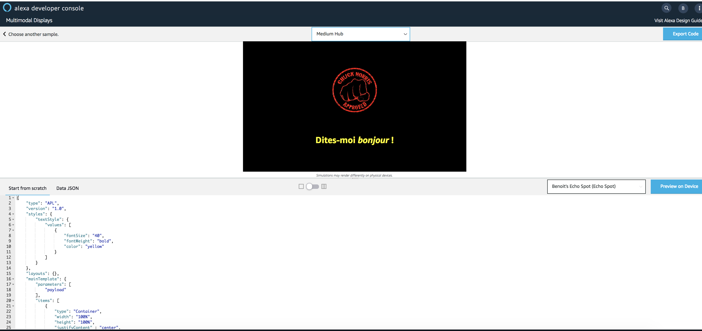
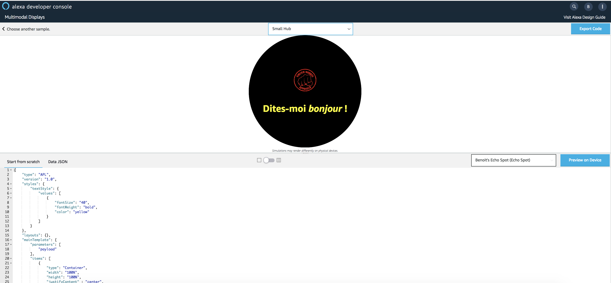
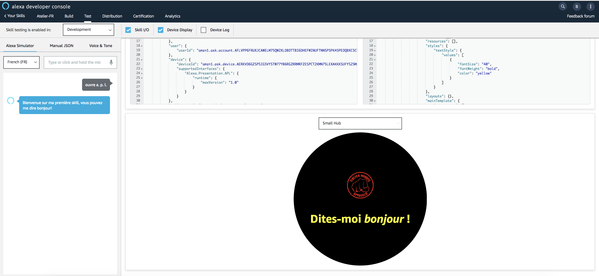

# Hello World APL Template (with Style)

You will update your First Alexa Presentation Language (APL) Document to use a ```style``` from the **APL Authoring Tool**.
Then, you will render your Alexa Presentation Language (APL) Document using the [Alexa Node.js SDKv2](https://github.com/alexa/alexa-skills-kit-sdk-for-nodejs). The APL Document will be rendered for the following request type : ```LaunchRequest```.

1. Go back to the [APL Authorhing Tool](https://developer.amazon.com/alexa/console/ask/displays)

2. Select `Start from Scratch`


3. Slide the toggle from the Triple Pane Editor to the Single Pane View.

**Before**


**After**


4. Copy and Paste the code from this [link](../lambda/custom/documents/template_withstyle.json) overwriting the empty APL document in the window.

5. Click on `Data JSON`


6. Copy and Paste the code from this [link](../lambda/custom/datasources/datasource_basic.json) overwriting the empty Data JSON in the window. You should now see a simulation of the display render in the viewport window!




7. Switch the viewport from Medium Hub to Small Round Hub.



## Bravo ! You have just created your first APL Template with a style. You will now use it in your Skill.


1. Navigate to the `Code` Tab of your Skill


2. Create a new File named [template_withstyle.json](../lambda/custom/documents/template_withstyle.json) in Folder ```lambda/documents``` and paste the `document` from the **APL Authoring Tool** into this file

> **Important:** Don't forget to save your file!

3. Open file ```index.js```

4. Locate the following Handler : `LaunchRequestHandler`

5. Update the document and datasource parameters of the APL Directive in ```handle(handlerInput)```  method

**Before**

```javascript
...
document: require('./documents/template_basic_withdatasource.json'),
...
```

**After**
```javascript
...
document: require('./documents/template_withstyle.json'),
...
```

6. Save your code


>  **Important**: The developer console does not automatically save your work as you make changes. If you close the browser window without clicking Save, your work is lost.

7. Deploy your code


> **Important**: You must successfully deploy the code before you can test it.

8. Navigate to the `Test` tab of your Skill

9. Test your Skill



## Bravo ! You have just rendered your first APL Template with a Style.

#### Next Step : [Add a Style from Alexa Package to your APL Template](./04-style-package.md)