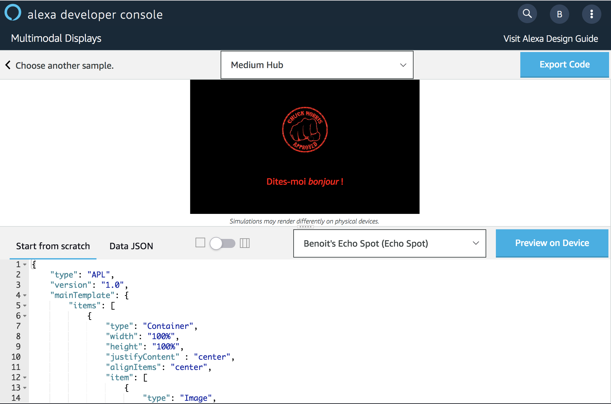
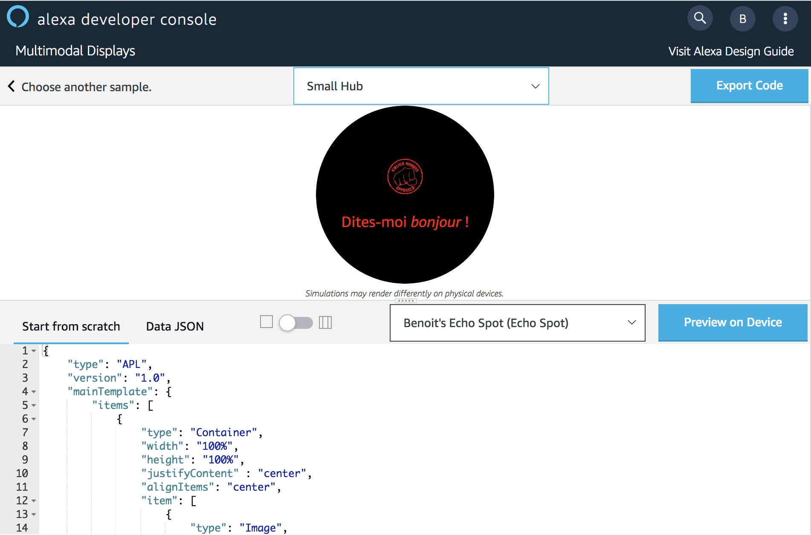

# Hello World APL Template

You will create your First Alexa Presentation Language (APL) Document using the **APL Authoring Tool**.

1. Open [APL Authorhing Tool](https://developer.amazon.com/alexa/console/ask/displays)

2. Select `Start from Scratch`


3. Slide the toggle from the Triple Pane Editor to the Single Pane View.

**Before**


**After**


> **Note**
>
> Now we have a scratch APL Document. 
> Let’s learn about all the elements that compose one.

**The fundamental elements of an empty APL document :**


```
{
    "type": "APL",
    "version": "1.0",
    "theme": "dark", 
    "import": [], 
    "resources": [], 
    "styles": {}, 
    "layouts": {}, 
    "mainTemplate": { 
        "items": []
    }
}

```
* The `theme` reflects the basic color scheme in use on the device, options here are dark or light.

* `Import` allows reference of external styles, resources, or layouts to be used by your APL document.

* `Resources` are a constant used when drawing text, images, and layouts on the screen. Using a named constant allows reuse of an APL document across different devices by providing per-device resources.

* `Styles` are a collection of state-dependent resources. For example, the flatButton style defines the size, background color, text color, border color, border width, and border radius of one type of button for the “normal”, “pressed”, “focused”, and “disabled” states. All APL components have a clearly documented list of styled properties.

* `Layouts` are composed of visual components. Portions of the layout can be dependent on the screen size/shape or and may include other layouts

* The `mainTemplate` property is a pre-defined layout. This is the layout that will be inflated when the APL document is first instantiated on the screen.

4. Copy and Paste the code from this [link](../lambda/custom/documents/template_basic.json) overwriting the empty APL document in the window. You should now see a simulation of the display render in the viewport window!



> *Note*
>
> We can preview how the document will look across different devices by manipulating the viewport in the APL Authoring Tool. Viewports can be changed from small round, medium, large, and extra large and layouts can be optimized for each of these viewports. It’s best practice to start developing with the smallest form factor.

5. Switch the viewport from Medium Hub to Small Round Hub.



## Bravo ! You have just created your first APL Template

