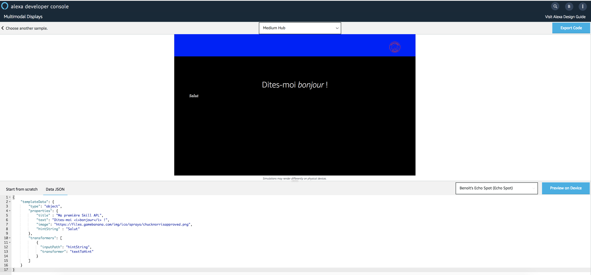
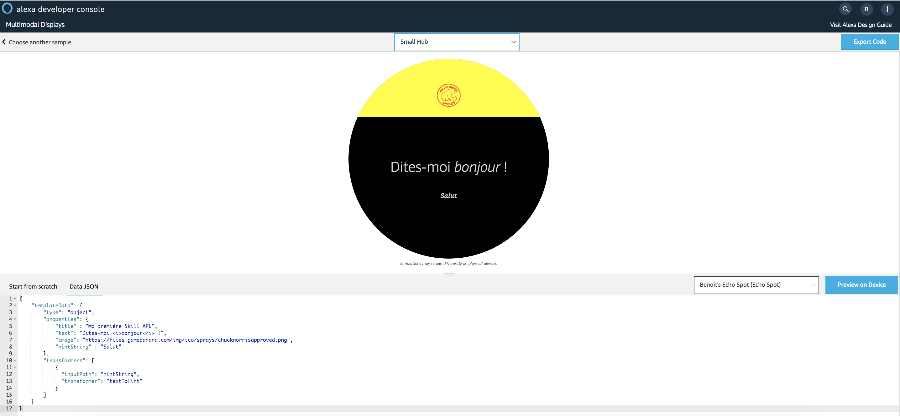
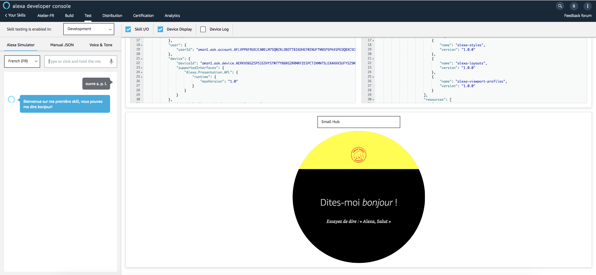

# Hello World APL Template (with Speech Transformer)

You will update your First Alexa Presentation Language (APL) Document to use [Speech Transformer](https://developer.amazon.com/docs/alexa-presentation-language/apl-data-source.html#ssmltospeech-transformer) from the **APL Authoring Tool**.
Then, you will render your Alexa Presentation Language (APL) Document using the [Alexa Node.js SDKv2](https://github.com/alexa/alexa-skills-kit-sdk-for-nodejs). The APL Document will be rendered for the following request type : ```LaunchRequest```.


1. Go back to the [APL Authorhing Tool](https://developer.amazon.com/alexa/console/ask/displays)

2. Select `Start from Scratch`


3. Slide the toggle from the Triple Pane Editor to the Single Pane View.

**Before**


**After**


4. Copy and Paste the code from this [link](../lambda/custom/documents/template_withspeechtransformer.json) overwriting the empty APL document in the window.

5. Click on `Data JSON`


6. Copy and Paste the code from this [link](../lambda/custom/datasources/datasource_withspeechtransformer.json) overwriting the empty Data JSON in the window. You should now see a simulation of the display render in the viewport window!




7. Switch the viewport from Medium Hub to Small Round Hub.



## Bravo ! You have just created your first APL Template using Speech Transformer. You will now use it in your Skill.


1. Navigate to Folder ```lambda/custom/documents```

2. Create a new File named [template_withspeechtransformer.json](../lambda/custom/documents/template_withspeechtransformer.json) in Folder ```documents``` and paste the `document` from the **APL Authoring Tool** into this file

3. Navigate to Folder ```lambda/custom/datasources```

4. Create a new File named [datasource_withspeechtransformer.json](../lambda/custom/datasources/datasource_withspeechtransformer.json) in Folder ```datasources``` and paste the `Data JSON` from the **APL Authoring Tool** into this file

5. Open your Skill ```index.js``` file

6. Locate the following Handler : `LaunchRequestHandler`

7. Update the method ```handle(handlerInput)``` to have both ```Alexa.Presentation.APL.RenderDocument``` and ```Alexa.Presentation.APL.ExecuteCommands``` directives

**Before**

```javascript
...
  handle(handlerInput) {
    const speechText = 'Bienvenue sur ma première skill, vous pouvez me dire bonjour!';
    const repromptText = 'Dites moi bonjour!';
    var builder = handlerInput.responseBuilder.speak(speechText).reprompt(repromptText);
    if (supportsAPL(handlerInput)) {
        builder.addDirective({
            type: 'Alexa.Presentation.APL.RenderDocument',
            version: '1.0',
            document: require('./documents/template_withhinttransformer.json'),
            datasources: require('./datasources/datasource_withhinttransformer.json')
        })
    }
    return builder.getResponse();
}
...
```

**After**
```javascript
...
  handle(handlerInput) {
    const speechText = 'Bienvenue sur ma première skill, vous pouvez me dire bonjour!';
    const repromptText = 'Dites moi bonjour!';
    var builder = handlerInput.responseBuilder.speak(speechText).reprompt(repromptText);
    if (supportsAPL(handlerInput)) {
        builder.addDirective({
            type: 'Alexa.Presentation.APL.RenderDocument',
            version: '1.0',
            token: 'SpeechDocumentToken',
            document: require('./documents/template_withspeechtransformer.json'),
            datasources: require('./datasources/datasource_withspeechtransformer.json')
        })
        .addDirective({
            type: 'Alexa.Presentation.APL.ExecuteCommands',
            version: '1.0',
            token: 'SpeechDocumentToken',
            commands: [{
                "type": "SpeakItem",
                "componentId": "idVoiceDemoText",
                "highlightMode": "line"
            }]
        })
    }
    return builder.getResponse();
}
...
```

8. Go back to the root folder of your Skill and Deploy your Skill backend code using ```ASK CLI```

```
ask deploy -t lambda
```

9. Open the [Developer Portal](https://developer.amazon.com/alexa/console/ask) and Navigate to your Skill Test Simulator page

10. Test your Skill



## Bravo ! You have just rendered your first APL Template with Alexa Speech Transformer.
