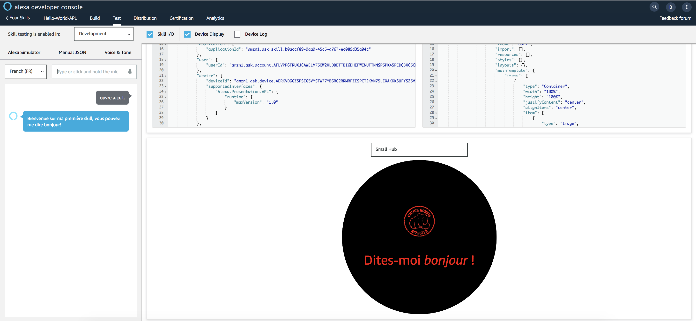

# Hello World APL Template (with Datasource)

You will update your First Alexa Presentation Language (APL) Document to use a ```datasource``` from the **APL Authoring Tool**.
Then, you will render your Alexa Presentation Language (APL) Document using the [Alexa Node.js SDKv2](https://github.com/alexa/alexa-skills-kit-sdk-for-nodejs). The APL Document will be rendered for the following request type : ```LaunchRequest```.


1. Go back to the [APL Authorhing Tool](https://developer.amazon.com/alexa/console/ask/displays)

2. Select `Start from Scratch`


3. Slide the toggle from the Triple Pane Editor to the Single Pane View.

**Before**


**After**


4. Copy and Paste the code from this [link](../lambda/custom/documents/template_basic_withdatasource.json) overwriting the empty APL document in the window.

5. Click on `Data JSON`


6. Copy and Paste the code from this [link](../lambda/custom/datasources/datasource_basic.json) overwriting the empty Data JSON in the window. You should now see a simulation of the display render in the viewport window!


7. Switch the viewport from Medium Hub to Small Round Hub.


## Bravo ! You have just created your first APL Template with a datasource. You will now use it in your Skill.


1. Navigate to Folder ```lambda/custom```

2. Create a new Folder named ```datasources```

3. Create a new File named [datasource_basic.json](../lambda/custom/datasources/datasource_basic.json) in Folder ```datasource``` and paste the `Data JSON` from the **APL Authoring Tool** into this file

4. Go back to Folder ```documents```

5. Create a new File named [template_basic_withdatasource.json](../lambda/custom/documents/template_basic_withdatasource.json) in Folder ```documents``` and paste the `document` from the **APL Authoring Tool** into this file

6. Open your Skill ```index.js``` file

7. Locate the following Handler : `LaunchRequestHandler`

8. Update the document and datasource parameters of the APL Directive in ```handle(handlerInput)```  method

**Before**

```javascript
...
document: require('./documents/template_basic.json'),
datasources: {}
...
```

**After**
```javascript
...
document: require('./documents/template_basic_withdatasource.json'),
datasources: require('./datasources/datasource_basic.json')
...
```

9. Go back to the root folder of your Skill and Deploy your Skill backend code using ```ASK CLI```

```
ask deploy -t lambda
```

10. Open the [Developer Portal](https://developer.amazon.com/alexa/console/ask) and Navigate to your Skill Test Simulator page

11. Test your Skill



## Bravo ! You have just rendered your first APL Template with a datasource

