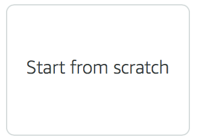
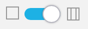
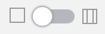
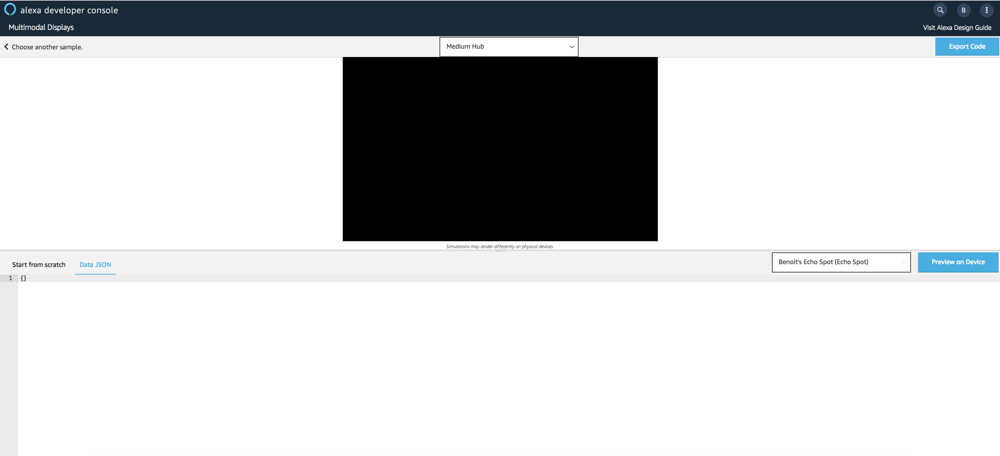
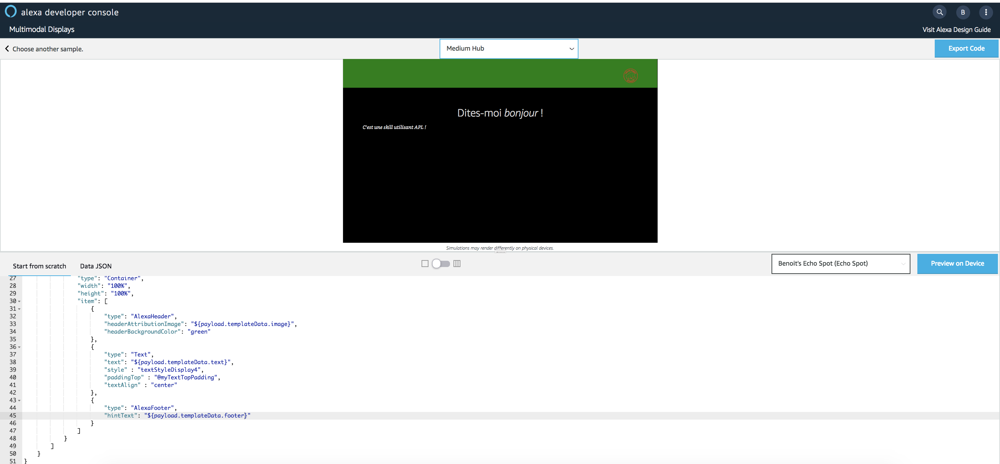
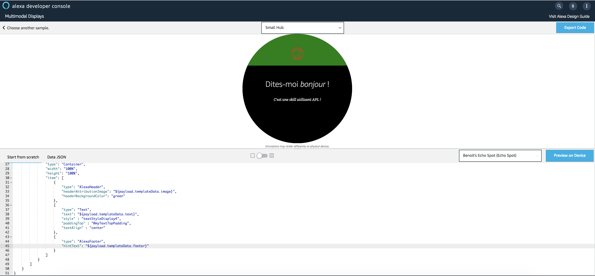
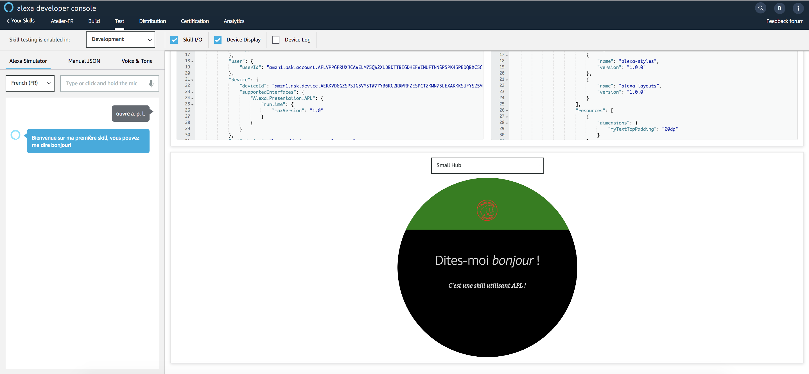

# Hello World APL Template (with Layout Package)

You will update your First Alexa Presentation Language (APL) Document to use [Alexa Layout Packages](https://developer.amazon.com/docs/alexa-presentation-language/apl-layouts-overview.html) from the **APL Authoring Tool**.
Then, you will render your Alexa Presentation Language (APL) Document using the [Alexa Node.js SDKv2](https://github.com/alexa/alexa-skills-kit-sdk-for-nodejs). The APL Document will be rendered for the following request type : ```LaunchRequest```.


1. Go back to the [APL Authorhing Tool](https://developer.amazon.com/alexa/console/ask/displays)

2. Select `Start from Scratch`



3. Slide the toggle from the Triple Pane Editor to the Single Pane View.

**Before**



**After**



4. Copy and Paste the code from this [link](../lambda/custom/documents/template_withlayoutpackage.json) overwriting the empty APL document in the window.

5. Click on `Data JSON`



6. Copy and Paste the code from this [link](../lambda/custom/datasources/datasource.json) overwriting the empty Data JSON in the window. You should now see a simulation of the display render in the viewport window!




7. Switch the viewport from Medium Hub to Small Round Hub.



## Bravo ! You have just created your first APL Template using Alexa Style Package. You will now use it in your Skill.


1. Navigate to Folder ```lambda/custom/documents```

2. Create a new File named [template_withlayoutpackage.json](../lambda/custom/documents/template_withlayoutpackage.json) in Folder ```documents``` and paste the `document` from the **APL Authoring Tool** into this file

3. Navigate to Folder ```lambda/custom/datasources```

4. Create a new File named [datasource.json](../lambda/custom/datasources/datasource.json) in Folder ```datasources``` and paste the `Data JSON` from the **APL Authoring Tool** into this file

5. Open your Skill ```index.js``` file

6. Locate the following Handler : `LaunchRequestHandler`

7. Update the document and datasource parameters of the APL Directive in ```handle(handlerInput)```  method

**Before**

```javascript
...
document: require('./documents/template_withlayout.json'),
datasources: require('./datasources/datasource_basic.json')
...
```

**After**
```javascript
...
document: require('./documents/template_withlayoutpackage.json'),
datasources: require('./datasources/datasource.json')
...
```

8. Go back to the root folder of your Skill and Deploy your Skill backend code using ```ASK CLI```

```
ask deploy -t lambda
```

9. Open the [Developer Portal](https://developer.amazon.com/alexa/console/ask) and Navigate to your Skill Test Simulator page

10. Test your Skill



## Bravo ! You have just rendered your first APL Template with Alexa Layout Package.
